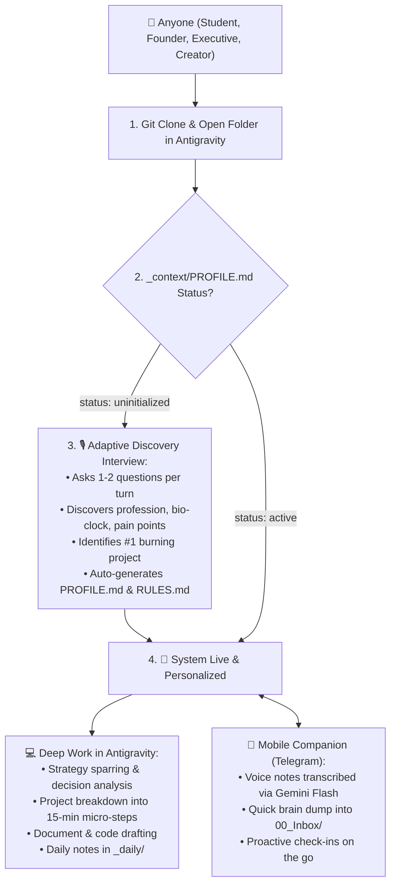

# 🧬 Antigravity Personal Second Brain (Open Source Kit)

<p align="center">
  <b>The Self-Adaptive Personal AI Digital Twin & Second Brain Operating System for <a href="https://deepmind.google/technologies/antigravity/">Google Antigravity</a> and <a href="https://obsidian.md/">Obsidian</a>.</b>
</p>

<p align="center">
  
  
  
  
</p>

---

## ⚡ What is this?

This is **NOT** another static note-taking template or rigid productivity framework.

It is a **Self-Bootstrapping Personal AI Agent Blueprint**. When you clone this repository and open it in **Google Antigravity**, your AI Agent conducts an interactive **Onboarding & Discovery Interview** with you. It learns your daily rhythm, profession, cognitive style, stress triggers, and active projects, and **automatically writes your personalized Operating System** (`PROFILE.md`, `RULES.md`, custom folders, and active trackers).

From day one, you get a dedicated **Digital Twin & Executive Chief of Staff** that lives on your machine, spars with you on decisions, keeps you accountable, and protects your focus.

---

## 🚀 60-Second Quickstart

### 1. Clone or Download this Repo
```bash
git clone https://github.com/DizBalanser/antigravity-second-brain.git
```

### 2. Open in Google Antigravity
Open **Antigravity** on your computer, click **«Open Folder»**, and select the cloned directory.

### 3. Say "Hello" (or "Привет")
In the Antigravity chat, type anything:
```text
Hi, let's get started!
```
Your agent will immediately detect that the system is brand new and initiate your **Adaptive Onboarding Interview**. Answer a few quick conversational questions, and your Second Brain configures itself in under 3 minutes!

---

## 🧭 Architecture Flow



---

## 📁 Repository & Vault Structure

Built on a battle-tested combination of **P.A.R.A.** (Projects, Areas, Resources, Archive) and **P.O.O.L.** (Single Source of Truth task tracking):

```text
antigravity-second-brain/
│
├── .agents/
│   └── AGENTS.md                  # 🧠 Core Agent Engine: Self-adaptive onboarding + operating rules
│
├── _context/                      # 💾 Long-Term Agent Memory
│   ├── PROFILE.md                 # Your psychological dossier, bio-clock, and priorities (auto-generated)
│   ├── RULES.md                   # Communication style, sparring rules, pushback preferences
│   ├── FOCUS_SYSTEM.md            # Daily focus architecture (The Rule of 3, daily checkpoints)
│   └── SYSTEM_CAPABILITIES.md     # Automated tools reference guide
│
├── _pool/
│   └── todo.md                    # 🎯 Single Source of Truth backlog (synced by the agent)
│
├── _daily/                        # 📅 Daily notes, milestone logs, and evening reflections
├── 00_Inbox/                      # 📥 Quick capture: raw thoughts, articles, voice transcripts
├── 10_Projects/                   # 🚀 Active projects with deadlines (e.g. startup, exams, product launch)
├── 20_Areas/                      # 🛡️ Ongoing life domains (Health, Career, Finances, Relationships)
├── 30_Resources/                  # 📚 Reference notes, cheat sheets, bookmarks
├── 40_Archive/                    # 📦 Completed or frozen endeavors
│
└── _system/                       # ⚡ Standalone Automations (Optional)
    ├── .env.example               # API credentials template
    └── telegram-bot/              # 📲 Mobile voice companion (Python)
        ├── bot.py
        └── requirements.txt
```

---

## 🧠 How the Self-Adaptive Onboarding Works

When `_context/PROFILE.md` has `status: uninitialized`, the agent acts as an empathetic, high-caliber interviewer. It walks through 4 simple dimensions:

1. **Identity & Core Objective:** What do you do, and what is the #1 project or bottleneck draining your mental RAM right now?
2. **Bio-Rhythm & Energy:** Are you an early bird or night owl? When is your peak creative focus, and when do you hit a mental slump?
3. **Cognitive & Stress Profile:** What causes you to procrastinate? In moments of overwhelm, do you need *hard facts and discipline* or *gentle validation and 15-minute micro-actions*?
4. **Communication Style:** Do you prefer a razor-sharp sparring partner who challenges your assumptions, an executive Chief of Staff who speaks in bullet points and numbers, or a supportive co-pilot?

Once finished, the agent writes your customized `PROFILE.md` and `RULES.md`, sets up initial project notes in `10_Projects/`, populates `_pool/todo.md`, and flips `status: active`.

---

---

## 🛠️ Modular Skills Included

The system includes pre-configured, extensible Antigravity skills in `.agents/skills/`:
- **`daily_planning`**: Generates high-leverage daily routines, prioritizes top-3 goals, and manages morning kickoff.
- **`inbox_processing`**: Triages raw notes, articles, and audio dumps using the P.A.R.A. methodology with automatic `[[wiki-links]]`.
- **`micro_sprint`**: 15-minute anti-procrastination engine that breaks inertia and builds immediate focus.
- **`core_memory`**: Dynamically mutates and updates user beliefs, habits, and preferences in `_context/PROFILE.md` over time (inspired by Letta/MemGPT).

---

## 📱 24/7 Mobile Copilot & Remote Terminal via Telegram

Want full control of your machine and Second Brain on your phone?
Use our 1-click installer:

### 1-Click Automated Setup:
- **Windows:** Double-click or run `setup.bat`
- **macOS / Linux:** Run `chmod +x setup.sh && ./setup.sh`

### What the Mobile Companion Can Do:
- **🎙️ Voice Note Transcription:** Instantly turns voice memos into organized Obsidian notes via Gemini 2.5 Flash.
- **⏱️ `/sprint [mins] [task]`:** Launches a 15-minute focus sprint. The bot starts a countdown and pings you when time is up.
- **📊 `/recap`:** Produces a structured evening summary of everything accomplished today.
- **🎯 `/focus`:** Shows your active sprint priorities and backlog.
- **💻 `/exec <cmd>`:** Executes terminal commands (PowerShell / Bash) directly on your home PC.
- **🔔 Proactive Check-in Engine:** Periodically pings you throughout the day (every ~3.5–4h) to maintain momentum.

---

## 🔒 100% Local-First & Private

- Your notes and markdown files stay on **your computer**.
- No proprietary cloud databases, no Docker, no monthly subscriptions.
- Completely compatible with **Obsidian**, **Cursor**, **VS Code**, and any markdown viewer.

---

## 🇷🇺 Краткое руководство на русском

1. **Клонируй репозиторий:** `git clone https://github.com/DizBalanser/antigravity-second-brain.git`
2. **Открой папку в Antigravity:** Запусти Antigravity и выбери эту папку через `Open Folder`.
3. **Напиши «Привет» в чат:** Агент сам запустит интерактивное знакомство, задаст пару простых вопросов о твоем графике, делах и привычках, и сам заполнит твой профиль `PROFILE.md` и правила общения `RULES.md`.
4. **Запусти мобильного ассистента в 1 клик:** Запусти `setup.bat` (Windows) или `./setup.sh` (Mac/Linux), введи ключи в `_system/.env` и запусти `bot.py`.
5. **Твой Второй Мозг готов!** Ты получаешь автономного цифрового напарника, который держит твои дела в фокусе, разгружает голову, запускает спринты против прокрастинации и помогает доводить начатое до конца.

---

## 🤝 Contributing & License

Contributions, feedback, and PRs are welcome! Distributed under the [MIT License](LICENSE).
Created with ❤️ for the AI agent community.
